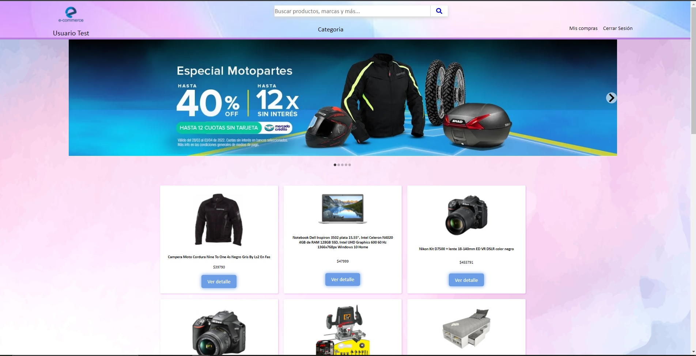
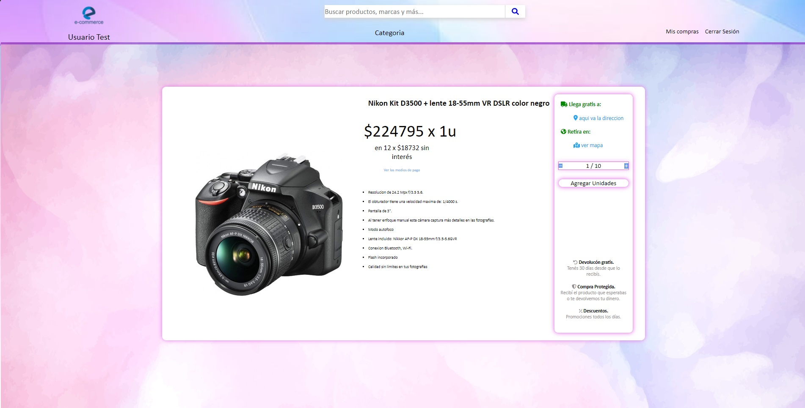
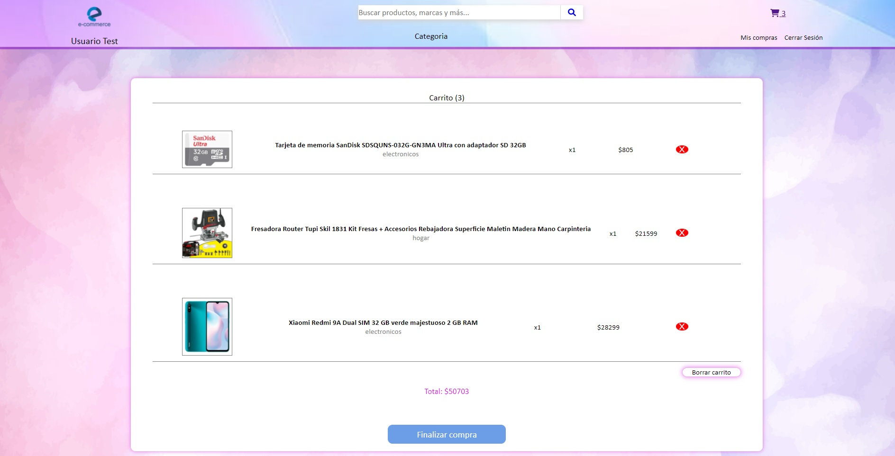
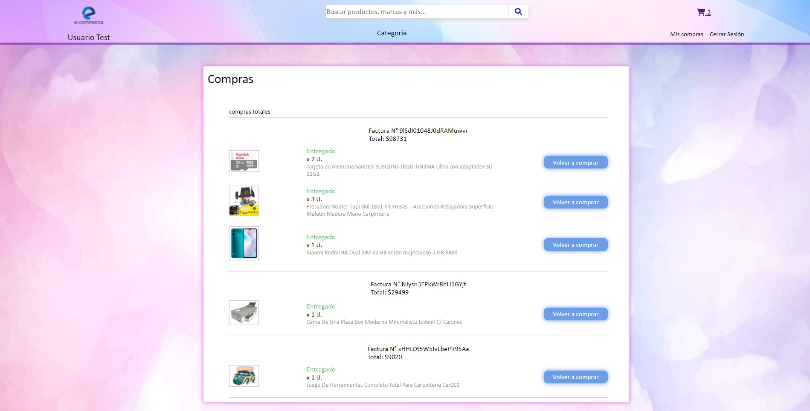
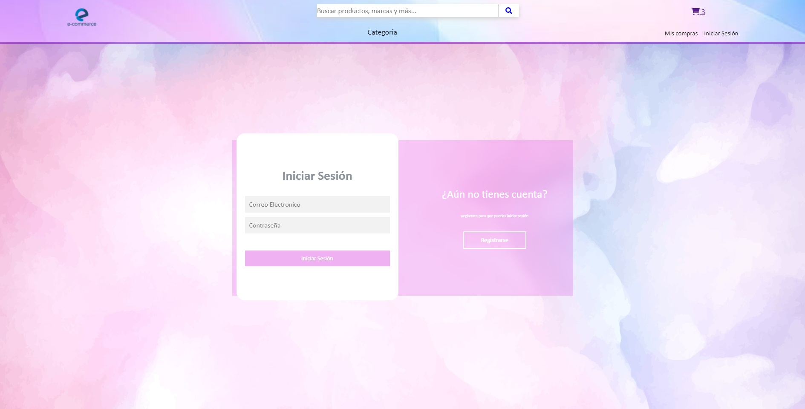
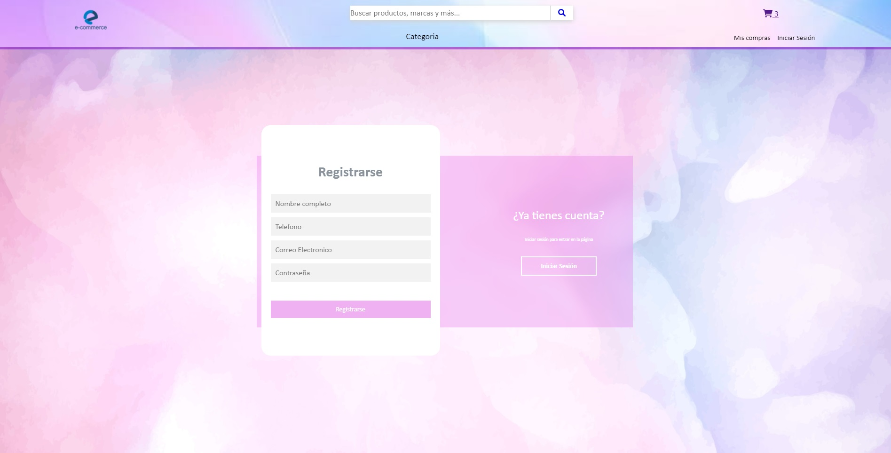

# E-Commerce Project
---

###Project description:

This project consists of an E-commerce developed with React.js and libraries that will be detailed later.
The project is only Front End and it is fully functional in all its proposed components (product details, shopping cart, user registration, login, view previous purchases, database connection)

---

###Libraries and Frameworks:

+ React.js (v17.0.2)
+ Font Awesome for React (v0.1.17)
+ react-router-dom (v6.2.2)
+ react-toastify (v8.2.0)
+ firebase (v9.6.10)
+ algoliasearch (v4.13.0)
+ react-slideshow-image (v3.7.0")

---

###Implementation:

React.js: It was used as the application development interface.

Font Awesome for React: Library of icons for the application.

React-router-dom: npm package that allowed to implement dynamic routing in the web application.

React-toastify: It was used for pop-up notifications to users.

Firebase: It was used as a database environment and user authentication.

Algoliasearch: Integration in conjunction with Firebase as a dynamic free text search engine.

React-slideshow-image: Library used for the creation of the slides of the project.

CSS: Libraries for the style sheet were not implemented.

---

[Link del Proyecto](https://github.com/carlos33936079/proyecto_integrador_coderhouse)
[Link repositorio personal](https://github.com/carlos33936079)

---

[Link de la pagina](https://taupe-unicorn-fc5361.netlify.app)

---

###Install:

1. Open Git Bash.

2. Change the current working directory to the location where you want to clone the directory.

3. Type `git clone`, and then paste the URL you copied earlier.
~~~
$ git clone https://github.com/carlos33936079/proyecto_integrador_coderhouse
~~~
4. Hit Enter to create your local clone.
~~~
$ git clone https://github.com/carlos33936079/proyecto_integrador_coderhouse
> Cloning into `Spoon-Knife`...
> remote: Counting objects: 10, done.
> remote: Compressing objects: 100% (8/8), done.
> remove: Total 10 (delta 1), reused 10 (delta 1)
> Unpacking objects: 100% (10/10), done.
~~~
5. Install the necessary repository dependencies. On the command line, run the following command:
~~~
npm install
~~~
6. 
Start the repository. On the command line, run the command:
~~~
npm start
~~~
